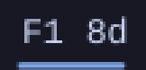
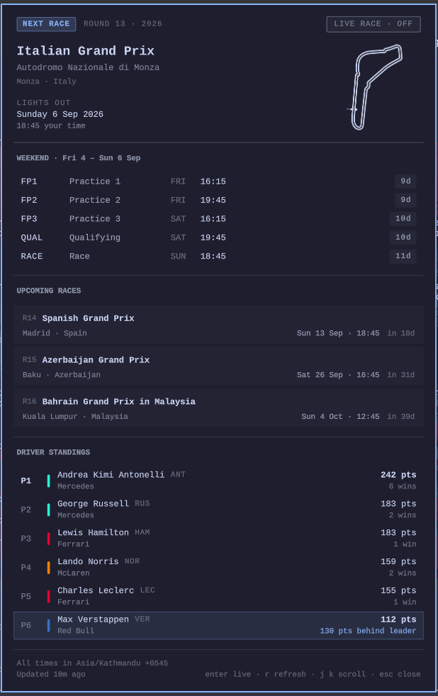
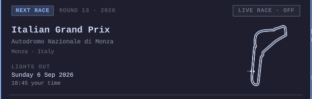
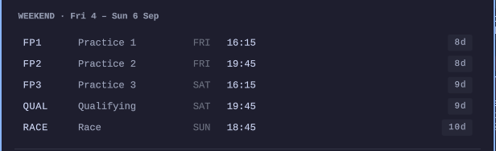
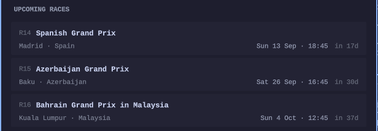
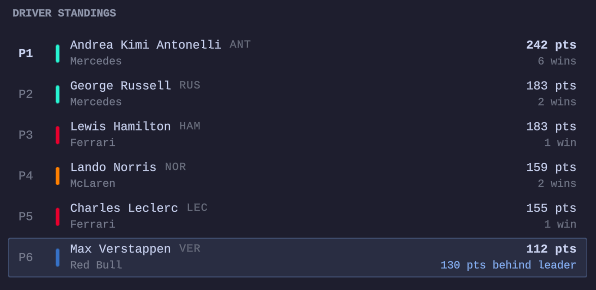
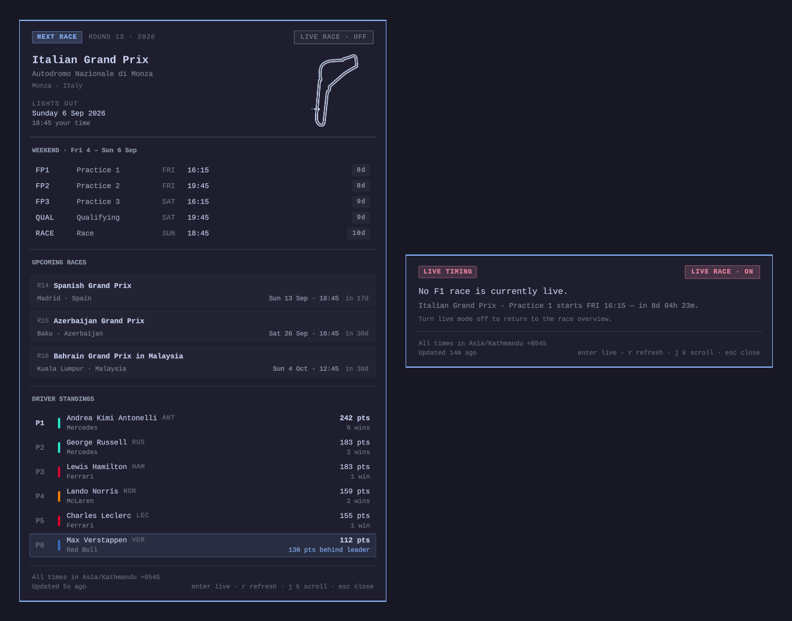
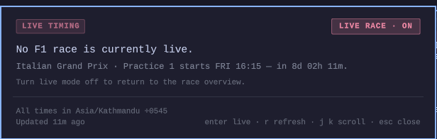

# F1 Live for Omarchy

A bar widget and dashboard panel for the [Omarchy](https://omarchy.org) shell:
a **live timing tower** while a session is running, **live driver standings**
carrying the points gap your pinned driver (Max Verstappen by default) holds to
the championship leader, the next Grand Prix and its full weekend schedule **in
your laptop's own timezone**, the starting grid, and the circuit map.

Built as a normal third-party Omarchy plugin — a `manifest.json` plus QML,
loaded into the running `omarchy-shell` process, themed entirely from
`qs.Commons`/`qs.Ui`, so it follows your theme, font, spacing, and corner
radius without configuration.

<p align="center">
  
</p>

The bar pill counts down to the next session. Click it for the dashboard; it
turns your theme's active colour while a session is running.

<p align="center">
  
</p>

## Install

```bash
omarchy plugin add https://github.com/marconn01/live-f1.git --enable
omarchy bar move nocram.f1 --section right
```

That clones the plugin into `~/.config/omarchy/plugins/nocram.f1`, enables it,
and puts the pill in the bar. Later:

```bash
omarchy plugin update nocram.f1    # pull the latest version
omarchy plugin disable nocram.f1   # take it out of the bar, keep it installed
omarchy plugin remove nocram.f1    # uninstall
```

### From a local clone

```bash
git clone https://github.com/marconn01/live-f1.git
cd live-f1
./install.sh                      # copy into ~/.config/omarchy/plugins/nocram.f1
omarchy plugin enable nocram.f1
omarchy bar move nocram.f1 --section right
```

`./install.sh --link` symlinks instead of copying, for development — saving a
file under `~/.config/omarchy/plugins/` hot-reloads the plugin.

### What it writes, and uninstalling

Nothing outside your home directory, and nothing needs root:

| Path | Contents |
|---|---|
| `~/.config/omarchy/plugins/nocram.f1` | the plugin itself |
| `~/.cache/omarchy/f1` | cached API responses, so the panel opens instantly and still works offline |
| `~/.local/state/omarchy/f1/notified.json` | which notifications have already fired, so a restart cannot repeat one |
| `~/.local/state/omarchy/f1/openf1.auth` | the cached OpenF1 bearer token, `0600`, only if you set up live access |
| `~/.config/omarchy/f1/credentials` | your OpenF1 client id and secret, if you created it — see below |

`./install.sh --remove` deletes all three (add `--keep-data` to keep the cache
and state). `omarchy plugin remove nocram.f1` removes only the plugin
directory — clear the other two with:

```bash
rm -rf ~/.cache/omarchy/f1 ~/.local/state/omarchy/f1
```

### Requirements

Omarchy with `omarchy-shell` running, and `curl` (used for every network
request). Nothing else — no Python, no runtime dependencies, no build step.

## Timezone

Every date and time in the plugin is your laptop's local time. Nothing shows
UTC, the API's timezone, or the circuit's local time.

This is enforced structurally rather than by convention:

- Sessions are carried everywhere as **absolute instants** (epoch
  milliseconds). No component stores or compares a formatted string.
- **`F1Time.js` is the only file that converts an instant to a wall clock.**
  The panel exposes a handful of `fmt*` helpers over it, and every component
  is handed already-formatted text. There is no second place to get it wrong.
- Countdowns are pure instant arithmetic, so a DST boundary between now and
  lights-out cannot skew them.
- **A timezone change is picked up while running.** The QML engine resolves
  the system zone once and caches it, so `TimeService.qml` asks the OS for its
  current UTC offset (every five minutes, on wake, and whenever the panel
  opens), compares it against the engine's, and feeds the difference to
  `F1Time` as a correction. Fly somewhere and the panel re-renders in the new
  zone without a restart. The active zone is printed in the panel footer.

Time format is the only time-related setting; the zone itself is always
detected, never configured.

## What it shows

**Next race** — Grand Prix, circuit, country, circuit map, race date and start
time in local time, and the full weekend schedule with every session marked
completed / live / starting soon / upcoming, each carrying its own countdown.
Sprint weekends are flagged in the hero and show their own sessions. Only the
next race gets this detail.

<p align="center">
  
</p>

<p align="center">
  
</p>

**Race weekend state** — the headline adapts: `NEXT RACE`, `FP1 STARTS SOON`,
`QUALIFYING LIVE`, `RACE LIVE`, `RACE FINISHED`.

**Starting grid** — once qualifying has run, the grid appears, labelled
`STARTING GRID · QUALIFYING RESULT` so it is never mistaken for the
championship.

**Upcoming races** — compact cards: Grand Prix, location, local date and time,
sprint marker, countdown. No session breakdown.

<p align="center">
  
</p>

**Standings** — top five drivers with team and livery, and a configurable
driver (Max Verstappen by default) pinned below with their points gap to the
championship leader whenever they fall outside the top five. Set
`highlightDriver` to any surname, code, or driver id to follow someone else.

<p align="center">
  
</p>

**Live race** — a prominent toggle. On, the panel becomes a timing tower:
positions, abbreviations, teams and liveries, interval, gap to leader, pit
stops, `LAP 42 / 57`, flag state, and `Live • Updated 8s ago` freshness read
from the feed's own timestamps. With no session running it says so plainly and
points at the next one. Optionally switches on by itself when a race starts.

<p align="center">
  
</p>

<p align="center"><em>Live mode off and on, between race weekends.</em></p>

<p align="center">
  
</p>

## Configuration

Settings are inline on the plugin's `shell.json` entry, per Omarchy's
convention, and hot-reload on save:

```jsonc
{ "id": "nocram.f1",
  "timeFormat": "24-hour",        // or "12-hour"
  "autoLive": true,               // switch to live mode when a race starts
  "liveRefreshSec": 12,           // live poll cadence
  "refreshMinutes": 15,           // standings cadence
  "notifications": true,
  "notifyLeadMinutes": "30,15",
  "notifySessions": ["Race", "Qualifying", "Sprint"],
  "highlightDriver": "Verstappen" // surname, code, or driver id
}
```

## Keyboard

The panel is fully keyboard-driven: `enter`/`space` toggles live mode, `r`
refreshes, `j`/`k` (or arrows) scroll, `g`/`G` jump to top/bottom, `tab`
switches to the neighbouring bar panel, `esc` closes.

Every row carries an accessible name, every state is written as a word as well
as a colour, and every livery swatch is accompanied by the team's name — no
information is carried by colour alone.

## IPC

```bash
omarchy-shell nocram.f1 toggle          # open/close the dashboard
omarchy-shell nocram.f1 status          # one-line summary, in local time
omarchy-shell nocram.f1 live on|off|auto
omarchy-shell nocram.f1 refresh
```

Handy as a Hyprland binding:

```lua
o.bind("SUPER CTRL", "F", "F1 dashboard", "omarchy-shell nocram.f1 toggle")
```

## Data sources

Nothing is hardcoded — no dates, no standings, no driver positions.

| Data | Source |
|---|---|
| Calendar, circuits, driver standings, qualifying | [Jolpica-F1](https://github.com/jolpica/jolpica-f1) (the maintained Ergast successor) |
| Exact session start/end times, live timing | [OpenF1](https://openf1.org) |
| Circuit maps | shipped with the plugin in `circuits/` — SVG layouts from [julesr0y/f1-circuits-svg](https://github.com/julesr0y/f1-circuits-svg), matched to the round by circuit id |

They sit behind `DataService.qml` and `LiveService.qml`, with all parsing
isolated in pure JS modules, so replacing a provider means rewriting those
files and nothing else.

### Live timing needs an OpenF1 account

Jolpica is free and needs no key. OpenF1 is free for historical data, but as of
the 2026 season it refuses **every** endpoint — the historical ones included —
for as long as a session is actually running:

```
HTTP 401
{"detail":"Live F1 session in progress. Global API access (including past
 sessions) is restricted to authenticated users until the session ends."}
```

So the timing tower needs a paid OpenF1 account, or it will be empty for
exactly the ninety minutes you wanted it. Everything else in the panel — the
countdown, the weekend schedule, the standings, the circuit map, the
qualifying grid — is unaffected: it comes from Jolpica, and the session
schedule is served from cache while OpenF1 is closed.

To enable live timing, get credentials from [openf1.org](https://openf1.org)
and write them where the plugin looks:

```bash
mkdir -p ~/.config/omarchy/f1
cat > ~/.config/omarchy/f1/credentials <<'EOF'
client_id=your-client-id
client_secret=your-client-secret
EOF
chmod 600 ~/.config/omarchy/f1/credentials
```

`$OPENF1_CLIENT_ID` and `$OPENF1_CLIENT_SECRET` in the shell's environment work
too, and take precedence. Either way the plugin exchanges them at
`POST /token` for a bearer token, caches it in
`~/.local/state/omarchy/f1/openf1.auth` until a minute before it expires, and
sends it to `api.openf1.org` and to no other host.

The credentials never enter QML, never land in the plugin's settings, and never
appear in any process's argument list — `/proc/PID/cmdline` is world-readable,
so they travel from your `0600` file to curl through another `0600` file
instead (`curl --data-urlencode name@file` and `curl -H @file`). Both files are
deleted as soon as curl exits.

Without credentials nothing is different from before: no token request is ever
made, and the panel says plainly why the tower is empty instead of showing a
blank grid.

## Caching and offline behaviour

Every request goes through `CachedFetch.qml`, a read-through disk cache in
`~/.cache/omarchy/f1` with a per-resource TTL — the calendar refreshes twice a
day, standings on your interval. Each fetch
resolves to one of four states: served from cache, freshly fetched, **stale**
(the network failed, so the last good copy is served and the panel says so
with the age of the data), or empty. Writes are atomic, so an interrupted
download can never corrupt the cache. Failures retry with backoff.

Pull the network cable and the dashboard keeps working, labelled
`Offline — showing cached data from 20m ago`.

## Polling

Live timing is the only thing polled aggressively, and only while live mode is
on **and** a session is actually running — the toggle off or the chequered
flag stops every timer. Each tick is a single subprocess batching the feeds
that change per second; a slower one-a-minute tick batches those that don't.
Requests are windowed at both ends and merged into accumulated state, so a
tick stays a few hundred rows however long the race has been running.

If OpenF1 answers `401`, the fast tick drops to once a minute: there is nothing
a faster poll can win against a deliberate refusal, and it still picks live
timing back up the moment credentials appear or the session ends.

## Notifications

Off-by-default per session type and configurable lead times, sent through
`omarchy-notification-send`. Fired notifications are recorded in
`~/.local/state/omarchy/f1/notified.json`, so restarting the shell can't
announce the same session twice, and a reminder whose moment passed while the
laptop was asleep is retired rather than delivered late.

## Tests

The pure logic — the time layer, every parser, weekend state, the standings
pin, live-timing reduction — is covered by a Node harness that runs the exact
source the shell loads, against recorded real API responses:

```bash
node tests/run.js             # 54 tests
node tests/run.js --refresh   # re-record fixtures from the live APIs
```

## Layout

```
manifest.json        plugin manifest and settings schema
BarWidget.qml        the bar pill
Dashboard.qml        the panel: presentation and wiring only
F1Time.js            the timezone/date layer — the only converter
F1Model.js           calendar, sessions, weekend state, standings
F1Live.js            live timing reduction
F1Teams.js           team liveries
TimeService.qml      the clock, and live system-timezone detection
DataService.qml      calendar/standings/qualifying
LiveService.qml      OpenF1 live timing
CachedFetch.qml      read-through disk cache with offline fallback
F1Circuit.js         circuit id -> shipped map file
CircuitImage.qml     the shipped circuit map for the current round
circuits/            SVG track layouts, one per circuit
Notifier.qml         notification scheduling and de-duplication
StatusChip.qml SessionRow.qml
RaceCard.qml StandingRow.qml LiveRow.qml       presentational components
```

## Licence

MIT — see [LICENSE](LICENSE).

The circuit maps in `circuits/` are third-party SVGs from
[julesr0y/f1-circuits-svg](https://github.com/julesr0y/f1-circuits-svg) and
remain under their own terms. F1 data comes from public APIs; this plugin is
unofficial and is not associated with, endorsed by, or a product of Formula 1.
